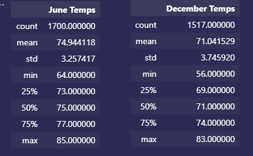
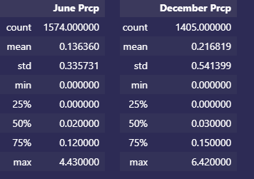

# Surfs Up
Using Statistical Analysis to Determine Temperature Trends
## Overview 
Use Python, Pandas, and SQLAlchemy to reflect tables into SQLite database to determine the temperature summary statistics for the island of Oahu in the months of June and December. 
## Results
After running analysis for June and December for the years 2010 - 2017 it was found that:
- The average temperature for both months were mid to low 70s.
   - June: 74.9
   - Dec: 71.0
- The minimum temperatures for both months were mid to low 80s
   - June: 65.0F degrees 
   - Dec: 56.0F
- The maximum temperatures for both months were mid to low 80s
   - June: 85.0
   - Dec: 83.0

**June vs Dec Temperature Summary Statistics**

## Summary
- Overall, there is not a significant temperature difference between the average temperatures in June and December. This suggests that the location would be ideal given that the temperature doesn’t vary much.
-	The largest temperature difference was between the minimum temperatures, 9-degrees. December fell below 60 which seems like an anomaly. After running a query for December temps below 60, 6 counts were returned. Temperatures less than 60 accounted for <1% in this timeframe, supporting Oahu as an ideal surf shop location.

**Temps Below 60 for Dec**

- Precipitation totals for June and December, like temperature, do not vary significantly. The average rainfall was less than 1inch and 75% of precipitation points fall below 0.15 inches.

 
 **June vs Dec Summary Stats for Precipitation**
